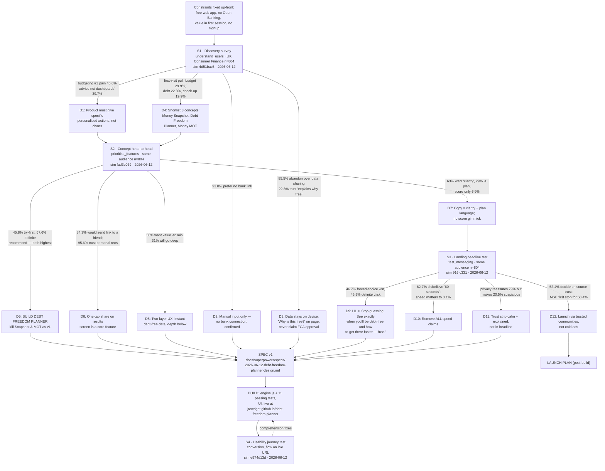

# Decision Inheritance Graph

How the product evolved through Semilattice simulations. Every simulation node lists the
decisions it produced; every decision lists where it flowed (next simulation, spec, build).
Sim IDs are real Semilattice simulation IDs (first 8 chars).

## Decision register

| ID | Decision | Evidence (sim → data point) | Flows into |
|----|----------|------------------------------|-----------|
| D1 | Give specific personalised actions, not dashboards | S1: 39.7% biggest complaint = "no advice, just data" | S2 concept wording, SPEC results design |
| D2 | Manual input; no bank connection | S1: 93.8% prefer/insist no bank link | SPEC, landing trust strip |
| D3 | Local-only data; "why free" transparency; no FCA claims | S1: 85.5% abandon over data sharing; FCA trust 39.3% (unclaimable); revenue transparency 22.8% | SPEC trust section, footer |
| D4 | Shortlist Snapshot / Debt Planner / Money MOT | S1: first-visit pull rankings (29.9 / 22.3 / 19.9%) | S2 inputs (the three concepts tested) |
| D5 | **Build Debt Freedom Planner** | S2: 45.8% try-first AND 67.6% definite-recommend (both #1) | SPEC scope |
| D6 | One-tap sharing on results | S2: 84.3% would send link; 95.6% trust personal recs | SPEC scope, growth plan |
| D7 | Clarity + plan copy; no score | S2: clarity 63%, plan 29.4%, score 6.9% | S3 headline candidates (all 5 use date/plan/clarity framing) |
| D8 | Instant headline result + optional depth | S2: 56% want <2 min, 31% want depth | SPEC UX (two-layer results) |
| D9 | H1 = "Stop guessing…" | S3: 46.7% forced-choice (2x runner-up), 46.9% definite click | index.html hero |
| D10 | No speed claims ("60 seconds" etc.) | S3: 62.7% find claim unbelievable; speed = 0.1% importance | All copy |
| D11 | Privacy/trust strip calm + explained, not headline | S3: reassures 79% but makes 20.5% suspicious | index.html trust strip + "Why free?" |
| D12 | Distribute via trusted communities (MSE-adjacent, Reddit), not ads | S3: 52.4% decide on source trust; MSE first stop for 50.4% | Launch plan |

## Versioning notes

- **SPEC v1** (2026-06-12): written after S1+S2; D9 placeholder pending S3.
- Each future simulation gets a node (S5, S6…) and its decisions get register rows; superseded decisions will be struck through, not deleted, so the evolution stays visible.
